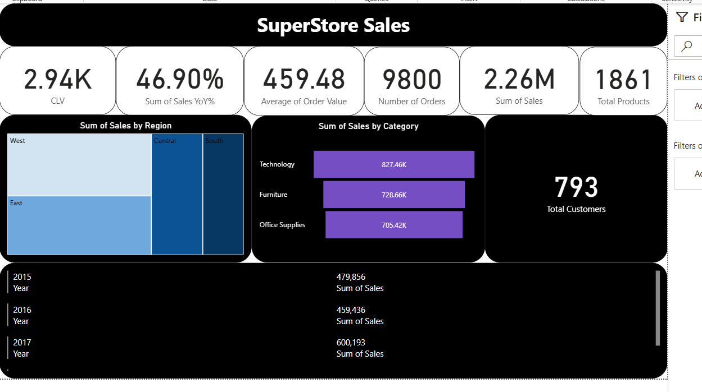
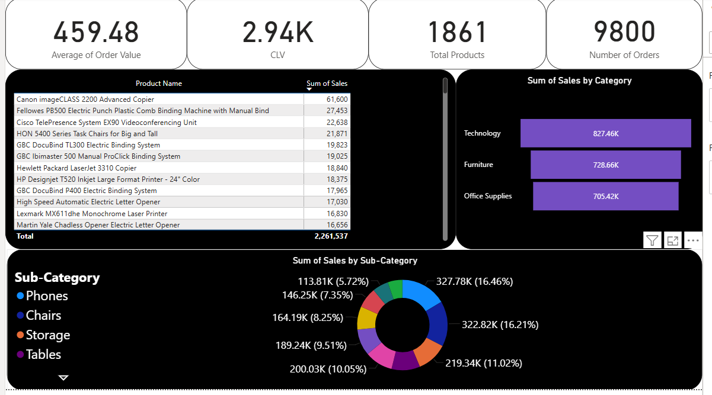
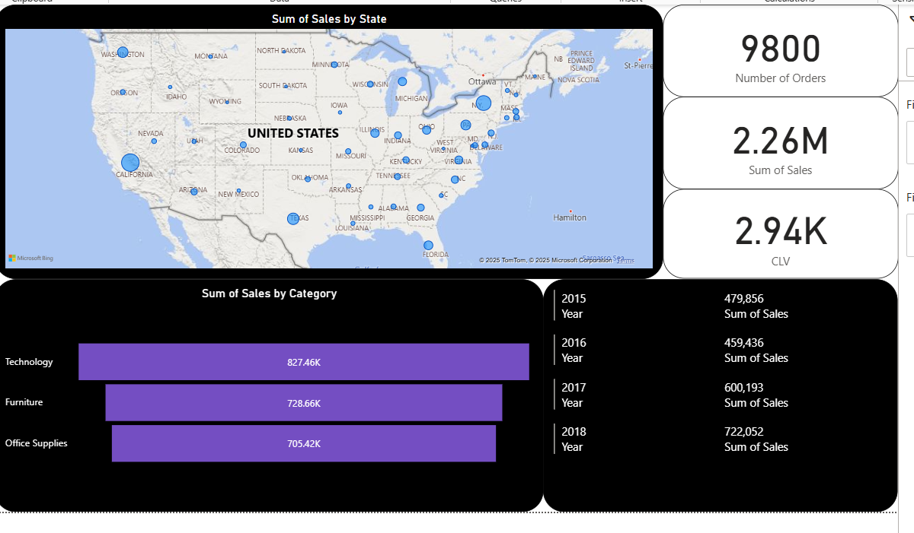

# 📊 Superstore Sales Analysis Dashboard

## 📝 Project Overview

This project presents a comprehensive analysis of Superstore sales data through an interactive Power BI dashboard. The primary focus is on uncovering sales patterns and generating insights across various product categories, U.S. states, and time periods.

### 1. Overall Sales Analysis

This Page provides a high-level summary of key performance indicators (KPIs) such as:
- Total Sales
- CLV
- Sum of Sales YoY%
- Average of Order Value
- Sum of Orders
- Total Products
- Total Customers
- Sum of sales by Region
- Sum of Sales by Category
- Sum of Sales by Year

### 2.Categories Sales Analysis

💡 Why Is Technology the Top-Selling Category?
One of the key business questions this dashboard answers is:
Why does the Technology category consistently lead in total sales?

🔍 After analyzing various metrics, the insight is both surprising and strategic:
It's not because Technology had the most:

Orders 🧾

Customers 👥

Products 📦

Or even the highest Customer Lifetime Value (CLV) 💳

🚫 None of these were the driving factors.

✅ The Real Reason? Order Value.
📈 Technology products had a significantly higher average order value:

3x more than Office Supplies

1.3x more than Furniture

And here’s the kicker:
When we look at the Top 10 highest-selling sub-categories,
🔥 Every single Technology sub-category is on that list.

This proves that a smaller number of high-value transactions is what pushes Technology to the top —
not volume, but value per transaction.

### 3.States and Years Sales Analysis

🌍 Why Do Some States Have Higher Sales Than Others?
Another critical insight uncovered in this analysis is the state-by-state sales variation.

🔍 At first glance, it might seem like population or customer count could explain the difference — but that wasn’t the case.

📦 The real driver was the number of Technology products sold.

States with higher sales figures also had significantly more purchases from the Technology category, which—as established—has the highest average order value.
🧠 In short: States that bought more Technology made more money.

📉 What Happened in 2016? A Dip in Sales Explained
Looking at sales over time, a big question pops up:
Why did sales decline in 2016 before rebounding in 2017 and 2018?

📉 The answer:
2016 had the lowest number of Technology products sold across all years.
Since Technology drives the largest portion of revenue, this drop directly caused the dip in total sales for the year.

🔁 The rebound in 2017 and 2018 aligns with a significant increase in Technology product sales, pushing the numbers back up again.

